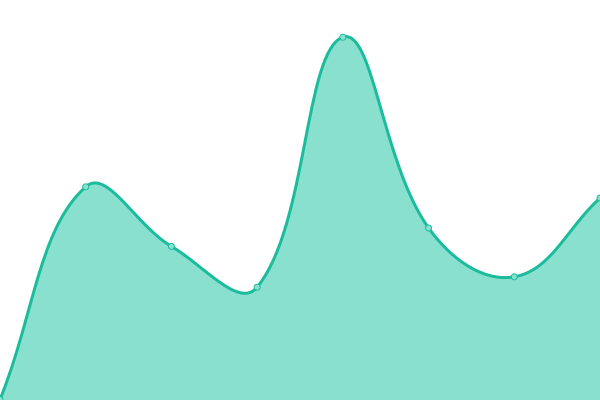

# [📈 Live Status](https://beedywool.github.io/SplatApp-Status): <!--live status--> **🟧 Partial outage**

This repository contains the open-source uptime monitor and status page for [Beedy](https://beedywool.github.io/SplatApp-Status), powered by [Upptime](https://github.com/upptime/upptime).

With [Upptime](https://upptime.js.org), you can get your own unlimited and free uptime monitor and status page, powered entirely by a GitHub repository. We use [Issues](https://github.com/beedywool/SplatApp-Status/issues) as incident reports, [Actions](https://github.com/beedywool/SplatApp-Status/actions) as uptime monitors, and [Pages](https://beedywool.github.io/SplatApp-Status) for the status page.

<!--start: status pages-->
<!-- This summary is generated by Upptime (https://github.com/upptime/upptime) -->
<!-- Do not edit this manually, your changes will be overwritten -->
<!-- prettier-ignore -->
| URL | Status | History | Response Time | Uptime |
| --- | ------ | ------- | ------------- | ------ |
|  [SplatApp Client](https://app.splatapp.ink) | 🟩 Up | [splat-app-client.yml](https://github.com/beedywool/SplatApp-Status/commits/HEAD/history/splat-app-client.yml) | 

 399ms
     
 | 

<a href="https://guillome-mgn.github.io/SplatApp-Status/history/splat-app-client">100.00%</a>
    

|  [SplatApp Fileserver](https://cdn.splatapp.ink/assets/img/appIcon.webp) | 🟩 Up | [splat-app-fileserver.yml](https://github.com/beedywool/SplatApp-Status/commits/HEAD/history/splat-app-fileserver.yml) | 

 412ms
     
 | 

<a href="https://guillome-mgn.github.io/SplatApp-Status/history/splat-app-fileserver">100.00%</a>
    

|  [SplatApp API](https://api.splatapp.ink/health) | 🟩 Up | [splat-app-api.yml](https://github.com/beedywool/SplatApp-Status/commits/HEAD/history/splat-app-api.yml) | 

 402ms
     
 | 

<a href="https://guillome-mgn.github.io/SplatApp-Status/history/splat-app-api">100.00%</a>
    

|  [SplatApp Demo](https://demo.splatapp.ink) | 🟥 Down | [splat-app-demo.yml](https://github.com/beedywool/SplatApp-Status/commits/HEAD/history/splat-app-demo.yml) | 

 0ms
     
 | 

<a href="https://guillome-mgn.github.io/SplatApp-Status/history/splat-app-demo">0.00%</a>
    

<!--end: status pages-->

[**Visit our status website →**](https://beedywool.github.io/SplatApp-Status)

## 📄 License

- Powered by: [Upptime](https://github.com/upptime/upptime)
- Code: [MIT](./LICENSE) © [Anand Chowdhary](https://anandchowdhary.com), supported by [Pabio](https://pabio.com)
- Data in the `./history` directory: [Open Database License](https://opendatacommons.org/licenses/odbl/1-0/)
